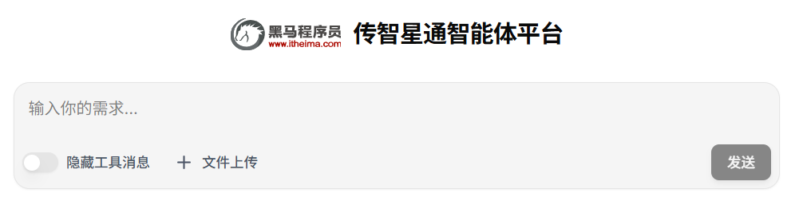

# 传智星通用智能体平台





传智星通用智能体通用智能体是一个功能强大、开箱即用的通用智能代理系统，基于最新的AI技术栈构建。


### 项目说明

本项目基于 **Langchain 1.0** 框架开发，旨在帮助开发者快速理解和搭建通用Agent平台。项目完全开源，既可用于学习研究，也可直接拿去商用。

### 适用场景

- 🎓 学习AI Agent开发的最佳实践
- 🔧 快速搭建企业级智能助手
- 🚀 二次开发定制化AI应用

### 关注在下

👉 **B站主页** ：[骰子AI](https://space.bilibili.com/497998686?spm_id_from=333.40164.0.0)
 获取项目最新动态、使用教程和技术分享

### 示例视频

1. [NLP交互式教程网站示例_哔哩哔哩_bilibili](https://www.bilibili.com/video/BV1h8vsBkEZZ?spm_id_from=333.788.videopod.episodes&vd_source=bc94e8f868f066fb821a0de022a1b052)
   - 对应结果: [NLP交互式教程网站示例.zip](assets/examples/NLP交互式教程网站示例.zip)

2. [联网搜索与制作excel示例_哔哩哔哩_bilibili](https://www.bilibili.com/video/BV1h8vsBkEZZ?spm_id_from=333.788.videopod.episodes&vd_source=bc94e8f868f066fb821a0de022a1b052&p=2)
   - 对应结果: [联网搜索与制作excel示例.zip](assets/examples/联网搜索与制作excel示例.zip)

3. [图文绘本制作示例_哔哩哔哩_bilibili](https://www.bilibili.com/video/BV1h8vsBkEZZ?spm_id_from=333.788.videopod.episodes&vd_source=bc94e8f868f066fb821a0de022a1b052&p=3)
   - 对应结果: [图文绘本制作示例.zip](assets/examples/图文绘本制作示例.zip)

## 主要功能特性

### 智能代理能力

- 工具调用
- 自主任务规划
- 多轮对话和上下文理解
- Agent Skill的制作与接入

### 多模态能力

- 图片、文档、PDF、WORD、EXCEL、PPT等文件均可接收与生成

- 暂不支持视频(因为视频模型太贵, 调试起来免费额度很快就要用完的, 不过框架在这想要扩展也不难)

### 联网搜索

- 集成Tavily搜索API
- 实时信息获取和验证
- 搜索结果智能整合

### 平台能力

- 支持多用户，多会话窗口

### 可扩展架构

- 模块化设计，易于扩展新功能
- 插件化工具系统
- 支持自定义子代理
- 支持自定义中间件
- 支持MCP接入
- 支持Agent Skill接入


## 配置要求

| 配置级别 | CPU  | 内存   | 适用场景           |
| -------- | ---- |------| ------------------ |
| 最低配置 | 2核  | 4GB  | 个人测试（比较极限） |
| 生产环境 | 4核+ | 8GB+ | 高并发场景         |

## Quick Start

1. 进入docker目录，复制.env.example文件为.env
```shell
cd docker
cp .env.example .env
```
2. 填写.env文件中其中这几项([.env.example(英文版)](docker/.env.example)或[.env.example.zh(中文版)](docker/.env.example.zh)文件有更详细说明)

   - OPENAI_API_KEY：SiliconFlow API 密钥 (必需)，用于访问硅基流动的AI模型服务，有免费额度, 获取地址: https://cloud.siliconflow.cn/i/FVis58aF

   - LANGSMITH_API_KEY ：LangSmith API 密钥 (必需),用于LangChain的追踪和监控功能, 免费注册地址: https://www.langsmith.com/

   - TAVILY_SEARCH_KEY：Tavily 搜索 API 密钥 (可选), 如果设置此密钥，将启用联网搜索功能, 免费注册地址: https://tavily.com/

   - HOST_IP ：服务器绑定的网络接口IP(必须), 需要外部可访问的IP地址也可是域名, 如无公网接口，则填写本地内网IP, 不可填写localhost或127.0.0.1

3. 启动docker容器
```shell
docker compose up -d
```
或者 从源码构建容器启动(推荐从源码构建, 因为DockerHub的镜像经常会忘了更新)
```shell
docker compose -f docker-compose.build.yml up --build  -d
```

4. 访问应用

   服务启动成功后，在浏览器中访问：

   - http://你的HOST_IP:3000   		 （前端操作界面）
   - http://你的HOST_IP:8000/docs   （后端接口文档)

## 技术栈


- **Python 3.11+** - 主要开发语言，提供强大的异步支持和类型提示
- **MCP (Model Context Protocol)** - 模型上下文协议，实现模型与工具的安全交互
- **Agent Skill** - 可插拔的技能模块，支持动态加载与热更新
- **Docker & Docker Compose** - 容器化部署和编排，确保环境一致性
- **LangChain 生态**
  - **LangChain v1.0** - AI应用开发框架
  - **LangGraph** - 工作流编排
  - **LangSmith** - AI应用可观测性平台，提供追踪、评估和监控
  - **DeepAgent** - langchain生态下的深度Agent
  - **Agent-Chat-UI** - 现成的前端用户界面 
- **PostgreSQL** - 关系型数据库，存储应用数据和用户配置
- **MinIO** - 高性能对象存储服务，用于文件管理和存储
- **Redis** - 内存数据存储，提供缓存、会话管理和消息队列功能
- **SiliconFlow API** - 大模型服务提供商，支持LLM、VLM、图像生成等多种AI模型
- **Tavily Search** - 联网搜索服务，提供实时信息获取能力


## 目录结构

```python
├── base/              # 基础配置
├── conn/              # 连接层（LLM、存储等）
├── content/           # 核心功能实现
│   ├── mcps/          # MCP连接
│   ├── middles/       # 中间件
│   ├── mytools/       # 自定义工具
│   ├── others/        # 其他功能
│   ├── skills/        # 初始的技能目录
│   ├── sub_agents/    # 子代理
│   └── utils/         # 工具函数
├── sub_projects/      # 子项目
│   ├── agent-chat-ui/ # 前端用户界面
│   └── ppt-mcp/       # PPT 内容处理服务
├── docker/            # Docker 配置
├── assits/            # 一些附件(与项目工程无关)
├── study/             # 学习相关内容(与项目工程无关)
└── utils/             # 通用工具
```


## FQA

**Q: 为什么必须填写HOST_IP，不能用localhost？**
A: 因为前后端在不同的Docker容器中运行，使用localhost会导致前端无法正确访问后端API。

**Q: 如何查看日志排查问题？**
A: 使用 `docker compose logs -f` 查看实时日志。

**Q: 如何停止和重启服务？**
A: 停止：`docker compose down`，重启：`docker compose restart`


## 贡献指南

欢迎贡献代码！请遵循以下步骤：

1. Fork 本仓库
2. 创建功能分支 (`git checkout -b feature/AmazingFeature`)
3. 提交更改 (`git commit -m 'Add some AmazingFeature'`)
4. 推送到分支 (`git push origin feature/AmazingFeature`)
5. 开启 Pull Request


## 未来计划

- 增加音视频能力

- 支持更灵活的配置模型

- 优化用户界面体验

- 增加用户可自行接入MCP的功能

- 增加用户可自行接入Agent Skills的功能


## 联系我们

- 💬 问题反馈：[提交Issue](https://github.com/rexrex9/all_agent/issues)
- 📺 B站：[骰子AI](https://space.bilibili.com/497998686)


## 致谢与引用

本项目在开发过程中参考和集成了以下优秀开源项目，特此致谢：

- **Agent Chat UI** - [langchain-ai/agent-chat-ui: 🦜💬 Web app for interacting with any LangGraph agent (PY & TS) via a chat interface.](https://github.com/langchain-ai/agent-chat-ui)
- **pptx-mcp** - [samos123/pptx-mcp: Create Slides with a simple MCP server using Python PPTX library](https://github.com/samos123/pptx-mcp)
- **excel-mcp-server** - [haris-musa/excel-mcp-server: A Model Context Protocol server for Excel file manipulation](https://github.com/haris-musa/excel-mcp-server)
- **martitdown** - [microsoft/markitdown: Python tool for converting files and office documents to Markdown.](https://github.com/microsoft/markitdown)

感谢以上项目作者的开源贡献，为社区提供了优质的技术方案。

------

**如果本项目对您有帮助，欢迎 Star ⭐ 支持我们！**


## 开源协议

本项目采用 **Apache License 2.0** 开源协议

[查看完整协议](LICENSE)


